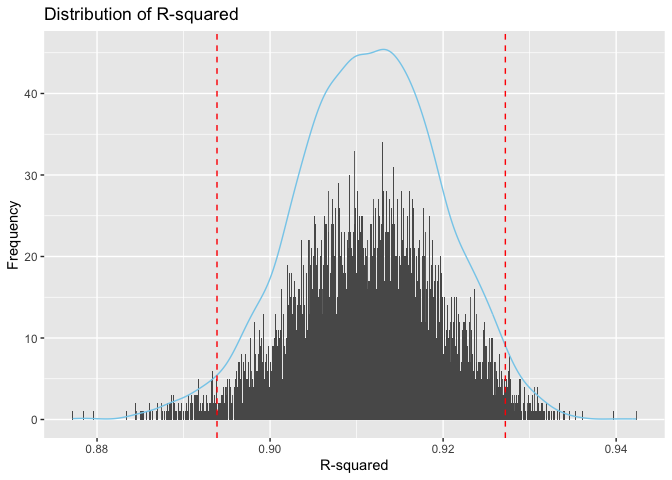
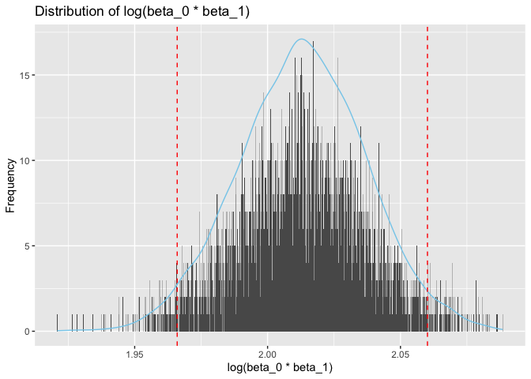
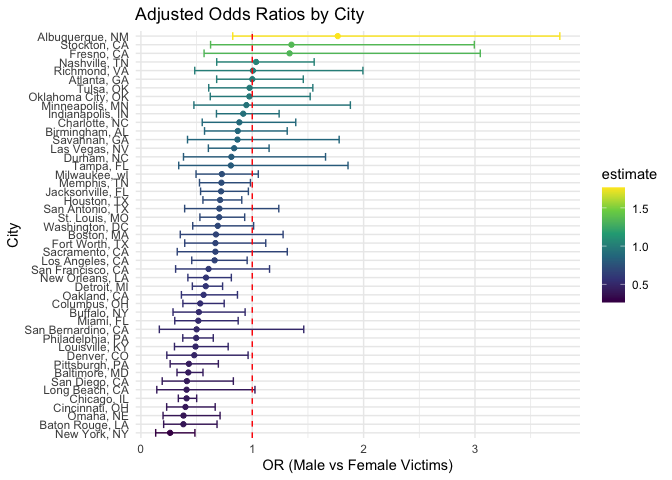
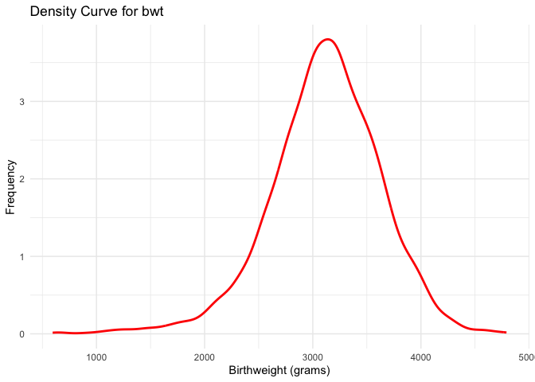
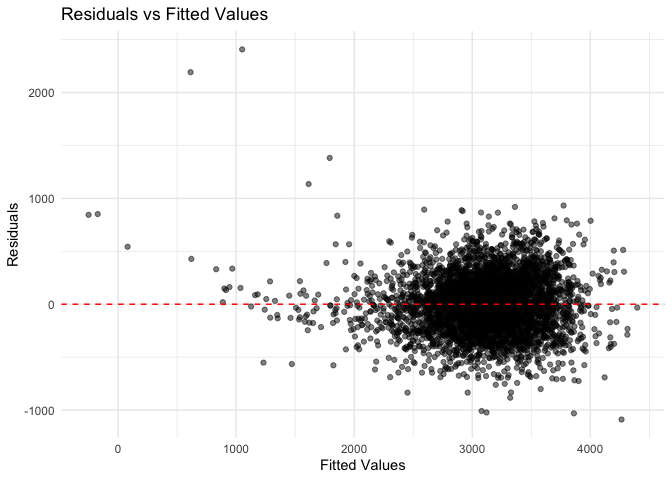

p8105_hw6_xq2241
================
Xinghao Qiao
2024-11-25

# Problem 1

First,we will download the dataset.

``` r
library(rnoaa)
```

    ## The rnoaa package will soon be retired and archived because the underlying APIs have changed dramatically. The package currently works but does not pull the most recent data in all cases. A noaaWeather package is planned as a replacement but the functions will not be interchangeable.

``` r
library(broom)
library(dplyr)
```

    ## 
    ## Attaching package: 'dplyr'

    ## The following objects are masked from 'package:stats':
    ## 
    ##     filter, lag

    ## The following objects are masked from 'package:base':
    ## 
    ##     intersect, setdiff, setequal, union

``` r
library(ggplot2)
library(rsample)
library (tidyr)
library(purrr)
# download dataset
weather_df = 
  rnoaa::meteo_pull_monitors(
    c("USW00094728"),
    var = c("PRCP", "TMIN", "TMAX"), 
    date_min = "2017-01-01",
    date_max = "2017-12-31") %>%
  mutate(
    name = recode(id, USW00094728 = "CentralPark_NY"),
    tmin = tmin / 10,
    tmax = tmax / 10) %>%
  select(name, id, everything())
```

    ## using cached file: /Users/kk/Library/Caches/org.R-project.R/R/rnoaa/noaa_ghcnd/USW00094728.dly

    ## date created (size, mb): 2024-11-22 21:38:19.157121 (8.667)

    ## file min/max dates: 1869-01-01 / 2024-11-30

According to the dataset,we can do the boostrap analysis to find the
distribution of $\hat{r}^2$ and \$ (\_0 \_1)\$.

``` r
# boostrap
bootstrap_regression <- function(data, indices) {
  # Resample
  sample_data <- data[indices, ]
  
  # Fit model
  model <- lm(tmax ~ tmin, data = sample_data)
  
  # R-squared and coefficients
  r_squared <- glance(model)$r.squared
  coefficients <- coef(model)
  log_beta <- log(coefficients[1] * coefficients[2])
  
  return(c(r_squared = r_squared, log_beta = log_beta))
}

# bootstrap with 5000 resamples
set.seed(1) 
bootstrap_results <- boot::boot(
  data = weather_df,
  statistic = bootstrap_regression,
  R = 5000
)

# Extract results into a data frame
bootstrap_df <- as.data.frame(bootstrap_results$t)
colnames(bootstrap_df) <- c("r_squared", "log_beta")
```

Then,we will identify the 2.5% and 97.5% quantiles for $\hat{r}^2$ and
\$ (\_0 \_1)\$ to construct the 95% CI.

``` r
# 95% CI 
ci_r_squared <- quantile(bootstrap_df$r_squared, c(0.025, 0.975))
ci_log_beta <- quantile(bootstrap_df$log_beta, c(0.025, 0.975))

print("95% CI for r-squared:")
```

    ## [1] "95% CI for r-squared:"

``` r
print(ci_r_squared)
```

    ##      2.5%     97.5% 
    ## 0.8938656 0.9271926

``` r
print("95% CI for log(beta_0 * beta_1):")
```

    ## [1] "95% CI for log(beta_0 * beta_1):"

``` r
print(ci_log_beta)
```

    ##     2.5%    97.5% 
    ## 1.965999 2.060154

Finally,we will plot the distribution.

``` r
# R-squared distribution
ggplot(bootstrap_df, aes(x = r_squared)) +
  geom_histogram(binwidth=0.0001) +
  geom_density(color = "skyblue")+
  geom_vline(xintercept = ci_r_squared, linetype = "dashed", color = "red") +
  labs(title = "Distribution of R-squared",
       x = "R-squared",
       y = "Frequency")
```

<!-- -->

``` r
# logbeta distribution
ggplot(bootstrap_df, aes(x = log_beta)) +
  geom_histogram(binwidth=0.0001) +
  geom_density(color = "skyblue")+
  geom_vline(xintercept = ci_log_beta, linetype = "dashed", color = "red") +
  labs(title = "Distribution of log(beta_0 * beta_1)",
       x = "log(beta_0 * beta_1)",
       y = "Frequency")
```

<!-- -->
From the distribution plots, both $\hat{r}^2$ and \$ (\_0 \_1)\$ follow
the normal distribution,and most of the quantities of these two value
distribute within the 95% confidence interval for each.

# Problem 2

For this question,we will import the data first.

``` r
# Import raw data
url <- "https://raw.githubusercontent.com/washingtonpost/data-homicides/master/homicide-data.csv"
homicide_data <- read.csv(url)
head(homicide_data)
```

    ##          uid reported_date victim_last victim_first victim_race victim_age
    ## 1 Alb-000001      20100504      GARCIA         JUAN    Hispanic         78
    ## 2 Alb-000002      20100216     MONTOYA      CAMERON    Hispanic         17
    ## 3 Alb-000003      20100601 SATTERFIELD      VIVIANA       White         15
    ## 4 Alb-000004      20100101    MENDIOLA       CARLOS    Hispanic         32
    ## 5 Alb-000005      20100102        MULA       VIVIAN       White         72
    ## 6 Alb-000006      20100126        BOOK    GERALDINE       White         91
    ##   victim_sex        city state      lat       lon           disposition
    ## 1       Male Albuquerque    NM 35.09579 -106.5386 Closed without arrest
    ## 2       Male Albuquerque    NM 35.05681 -106.7153      Closed by arrest
    ## 3     Female Albuquerque    NM 35.08609 -106.6956 Closed without arrest
    ## 4       Male Albuquerque    NM 35.07849 -106.5561      Closed by arrest
    ## 5     Female Albuquerque    NM 35.13036 -106.5810 Closed without arrest
    ## 6     Female Albuquerque    NM 35.15111 -106.5378        Open/No arrest

Then we add the city_state variable,a binary variable indicating whether
the homicide is solved and revise the data.

``` r
homicide_data <- homicide_data |>
  mutate(
    city_state = paste(city, state, sep = ", "),
    resolved = ifelse(disposition == "Closed by arrest", 1, 0)
  )
# Rrevise the data
r_data <- homicide_data |>
  filter(
    !(city_state %in% c("Dallas, TX", "Phoenix, AZ", "Kansas City, MO", "Tulsa, AL")),
    victim_race %in% c("White", "Black")
  ) |>
  mutate(victim_age = suppressWarnings(as.numeric(victim_age))) |>
  filter(!is.na(victim_age))# victim_age is numeric
```

Now,we can use the glm function to fit a logistic regression for
Baltimore, MD.And the estimate and confidence interval of the adjusted
odds ratio for solving homicides comparing male victims to female
victims will be shown.

``` r
b_data <- r_data |>
  filter(city_state == "Baltimore, MD")

# logistic regression
b_glm <- glm(resolved ~ victim_age + victim_sex + victim_race, 
                     data = b_data, 
                     family = "binomial")

# OR and CI for male vs female
baltimore_results <- tidy(b_glm, exponentiate = T, conf.int = T) %>%
  filter(term == "victim_sexMale")

baltimore_results
```

    ## # A tibble: 1 × 7
    ##   term           estimate std.error statistic  p.value conf.low conf.high
    ##   <chr>             <dbl>     <dbl>     <dbl>    <dbl>    <dbl>     <dbl>
    ## 1 victim_sexMale    0.426     0.138     -6.18 6.26e-10    0.324     0.558

Now,we will run glm for each of the cities in dataset to repeat the
above steps.

``` r
city <- r_data |>
  group_by(city_state) |>
  nest() |>
  mutate(
    model = map(data, ~ glm(resolved ~ victim_age + victim_sex + victim_race, 
                            data = ., family = "binomial")),
    tidy_results = map(model, ~ tidy(.x, exponentiate = T, conf.int = T))
  ) |>
  unnest(tidy_results) |>
  filter(term == "victim_sexMale") |>
  select(city_state, estimate, conf.low, conf.high)
```

    ## Warning: There were 44 warnings in `mutate()`.
    ## The first warning was:
    ## ℹ In argument: `tidy_results = map(model, ~tidy(.x, exponentiate = T, conf.int
    ##   = T))`.
    ## ℹ In group 1: `city_state = "Albuquerque, NM"`.
    ## Caused by warning:
    ## ! glm.fit: fitted probabilities numerically 0 or 1 occurred
    ## ℹ Run `dplyr::last_dplyr_warnings()` to see the 43 remaining warnings.

``` r
city
```

    ## # A tibble: 47 × 4
    ## # Groups:   city_state [47]
    ##    city_state      estimate conf.low conf.high
    ##    <chr>              <dbl>    <dbl>     <dbl>
    ##  1 Albuquerque, NM    1.77     0.825     3.76 
    ##  2 Atlanta, GA        1.00     0.680     1.46 
    ##  3 Baltimore, MD      0.426    0.324     0.558
    ##  4 Baton Rouge, LA    0.381    0.204     0.684
    ##  5 Birmingham, AL     0.870    0.571     1.31 
    ##  6 Boston, MA         0.674    0.353     1.28 
    ##  7 Buffalo, NY        0.521    0.288     0.936
    ##  8 Charlotte, NC      0.884    0.551     1.39 
    ##  9 Chicago, IL        0.410    0.336     0.501
    ## 10 Cincinnati, OH     0.400    0.231     0.667
    ## # ℹ 37 more rows

Now,we create the plot for each city.

``` r
library(ggplot2)

city_results <- city |>
  arrange(estimate)

# Plot ORs and CIs
ggplot(city_results, aes(x = reorder(city_state, estimate), y = estimate,color = estimate)) +
  geom_point() +
  geom_errorbar(aes(ymin = conf.low, ymax = conf.high)) +
  geom_hline(yintercept = 1, linetype = "dashed", color = "red") + # ref line
  scale_color_viridis_c() +
  labs(
    title = "Adjusted Odds Ratios by City",
    x = "City",
    y = "OR (Male vs Female Victims)"
  ) +
  coord_flip() +
  theme_minimal()
```

<!-- --> In
summary,only Nashville,Fresno,Stockton and Albuguergue have odds
ratio(significantly greater than 1), which indicates male victims’
homicides are more likely to be resolved than female
victims’.Additionally,there are no difference in odds between male and
female victims in Richmond,Atlanta and Tulsa.And,the rest of cities’
female victims’ homicides are more likely to be resolved than male
victims’.

# Problem 3

First,we will import the data.

``` r
# Import data
url <- "https://p8105.com/data/birthweight.csv"
cbwt_data <- read.csv(url)
head(cbwt_data)
```

    ##   babysex bhead blength  bwt delwt fincome frace gaweeks malform menarche
    ## 1       2    34      51 3629   177      35     1    39.9       0       13
    ## 2       1    34      48 3062   156      65     2    25.9       0       14
    ## 3       2    36      50 3345   148      85     1    39.9       0       12
    ## 4       1    34      52 3062   157      55     1    40.0       0       14
    ## 5       2    34      52 3374   156       5     1    41.6       0       13
    ## 6       1    33      52 3374   129      55     1    40.7       0       12
    ##   mheight momage mrace parity pnumlbw pnumsga    ppbmi ppwt smoken wtgain
    ## 1      63     36     1      3       0       0 26.27184  148      0     29
    ## 2      65     25     2      0       0       0 21.34485  128      0     28
    ## 3      64     29     1      0       0       0 23.56517  137      1     11
    ## 4      64     18     1      0       0       0 21.84508  127     10     30
    ## 5      66     20     1      0       0       0 21.02642  130      1     26
    ## 6      66     23     1      0       0       0 18.60030  115      0     14

Now,we will clean the dataset.

``` r
data <- cbwt_data |>
  mutate(
    babysex = factor(babysex, labels = c("Male", "Female")),
    frace = factor(frace),
    mrace = factor(mrace),
    malform = factor(malform)
  )

data <- drop_na(data) # Removes missing data
```

With the cleaned data,we can find the distribution of the outcome
(birthweight).

``` r
# test normality 
ggplot(data, aes(x = bwt)) +
  geom_density(aes(y = after_stat(count)), color = "red", size = 1) + # Density 
  labs(
    title = "Density Curve for bwt",
    x = "Birthweight (grams)",
    y = "Frequency"
  ) +
  theme_minimal()
```

    ## Warning: Using `size` aesthetic for lines was deprecated in ggplot2 3.4.0.
    ## ℹ Please use `linewidth` instead.
    ## This warning is displayed once every 8 hours.
    ## Call `lifecycle::last_lifecycle_warnings()` to see where this warning was
    ## generated.

<!-- -->
Since the outcome is continuous and approximately normal distribution,we
could use the linear regression to fit the model.And then we can find
the correlation matrix to find the relationship between each variables.

``` r
numeric_data <- data %>%
  select(where(is.numeric)) %>%
  na.omit() 

cor_matrix <- cor(numeric_data) 
```

    ## Warning in cor(numeric_data): the standard deviation is zero

``` r
print(cor_matrix)
```

    ##                 bhead     blength          bwt        delwt      fincome
    ## bhead     1.000000000  0.63045480  0.747106776  0.214370719  0.115699146
    ## blength   0.630454800  1.00000000  0.743450753  0.229149444  0.078745057
    ## bwt       0.747106776  0.74345075  1.000000000  0.287889306  0.154571511
    ## delwt     0.214370719  0.22914944  0.287889306  1.000000000  0.034994354
    ## fincome   0.115699146  0.07874506  0.154571511  0.034994354  1.000000000
    ## gaweeks   0.378456488  0.35926367  0.412183348  0.124278465  0.106677673
    ## menarche -0.003016051 -0.02106739 -0.024424664 -0.085940103 -0.003535085
    ## mheight   0.116948174  0.16025985  0.192163204  0.411257622  0.131018596
    ## momage    0.108081296  0.08016031  0.135773400  0.074040925  0.323114207
    ## parity   -0.020039523 -0.03247008 -0.008374112 -0.004709123 -0.025942406
    ## pnumlbw            NA          NA           NA           NA           NA
    ## pnumsga            NA          NA           NA           NA           NA
    ## ppbmi     0.086556495  0.07401577  0.093945729  0.720504055 -0.020189000
    ## ppwt      0.136608829  0.14860464  0.182891964  0.870913274  0.047252637
    ## smoken   -0.053947231 -0.06562883 -0.075627807  0.048612734  0.077943047
    ## wtgain    0.183333740  0.19122376  0.247252588  0.424788310 -0.016037706
    ##                gaweeks      menarche     mheight      momage       parity
    ## bhead     0.3784564882 -0.0030160515  0.11694817  0.10808130 -0.020039523
    ## blength   0.3592636747 -0.0210673863  0.16025985  0.08016031 -0.032470081
    ## bwt       0.4121833483 -0.0244246642  0.19216320  0.13577340 -0.008374112
    ## delwt     0.1242784648 -0.0859401032  0.41125762  0.07404092 -0.004709123
    ## fincome   0.1066776727 -0.0035350852  0.13101860  0.32311421 -0.025942406
    ## gaweeks   1.0000000000 -0.0004362693  0.06213774  0.11390983 -0.079658854
    ## menarche -0.0004362693  1.0000000000  0.07411557  0.17603797  0.019476194
    ## mheight   0.0621377387  0.0741155687  1.00000000  0.10904804 -0.013423739
    ## momage    0.1139098271  0.1760379749  0.10904804  1.00000000  0.051954243
    ## parity   -0.0796588545  0.0194761938 -0.01342374  0.05195424  1.000000000
    ## pnumlbw             NA            NA          NA          NA           NA
    ## pnumsga             NA            NA          NA          NA           NA
    ## ppbmi     0.0273358740 -0.1218260802 -0.10073775  0.08124512 -0.005926674
    ## ppwt      0.0564730379 -0.0704995875  0.42668724  0.12959210 -0.011202947
    ## smoken    0.0362116820  0.0163746450  0.06098352  0.07545435 -0.005575698
    ## wtgain    0.1481459581 -0.0445137226  0.04847893 -0.08848760  0.011081927
    ##          pnumlbw pnumsga        ppbmi        ppwt       smoken      wtgain
    ## bhead         NA      NA  0.086556495  0.13660883 -0.053947231  0.18333374
    ## blength       NA      NA  0.074015773  0.14860464 -0.065628829  0.19122376
    ## bwt           NA      NA  0.093945729  0.18289196 -0.075627807  0.24725259
    ## delwt         NA      NA  0.720504055  0.87091327  0.048612734  0.42478831
    ## fincome       NA      NA -0.020189000  0.04725264  0.077943047 -0.01603771
    ## gaweeks       NA      NA  0.027335874  0.05647304  0.036211682  0.14814596
    ## menarche      NA      NA -0.121826080 -0.07049959  0.016374645 -0.04451372
    ## mheight       NA      NA -0.100737749  0.42668724  0.060983516  0.04847893
    ## momage        NA      NA  0.081245123  0.12959210  0.075454350 -0.08848760
    ## parity        NA      NA -0.005926674 -0.01120295 -0.005575698  0.01108193
    ## pnumlbw        1      NA           NA          NA           NA          NA
    ## pnumsga       NA       1           NA          NA           NA          NA
    ## ppbmi         NA      NA  1.000000000  0.85331676  0.007022980 -0.10992958
    ## ppwt          NA      NA  0.853316763  1.00000000  0.038854748 -0.07494032
    ## smoken        NA      NA  0.007022980  0.03885475  1.000000000  0.02706577
    ## wtgain        NA      NA -0.109929577 -0.07494032  0.027065774  1.00000000

From the matrix,we can choose the significant continuous variable
(absolute value of coefficient with bwt approaches to 1) and the
categorical variable to fit model.

``` r
model1 <- lm(bwt ~ babysex + bhead + gaweeks + wtgain + blength + fincome  + malform + mheight  + ppwt + frace + mrace, data = data)

# Summarize the model
summary(model1)
```

    ## 
    ## Call:
    ## lm(formula = bwt ~ babysex + bhead + gaweeks + wtgain + blength + 
    ##     fincome + malform + mheight + ppwt + frace + mrace, data = data)
    ## 
    ## Residuals:
    ##      Min       1Q   Median       3Q      Max 
    ## -1079.74  -183.90    -4.16   177.22  2424.47 
    ## 
    ## Coefficients:
    ##                 Estimate Std. Error t value Pr(>|t|)    
    ## (Intercept)   -6192.5441   138.1763 -44.816  < 2e-16 ***
    ## babysexFemale    32.5321     8.5175   3.819 0.000136 ***
    ## bhead           132.8541     3.4698  38.289  < 2e-16 ***
    ## gaweeks          10.7829     1.4692   7.339 2.55e-13 ***
    ## wtgain            3.9550     0.3952  10.007  < 2e-16 ***
    ## blength          76.3430     2.0300  37.607  < 2e-16 ***
    ## fincome           0.3511     0.1766   1.988 0.046843 *  
    ## malform1         -3.2351    71.1683  -0.045 0.963745    
    ## mheight           6.0820     1.8006   3.378 0.000737 ***
    ## ppwt              1.3395     0.2341   5.723 1.12e-08 ***
    ## frace2           17.2655    46.5006   0.371 0.710434    
    ## frace3           32.3973    69.8116   0.464 0.642623    
    ## frace4          -31.9521    44.9721  -0.710 0.477440    
    ## frace8           -8.0677    74.6516  -0.108 0.913944    
    ## mrace2         -134.7503    46.3494  -2.907 0.003665 ** 
    ## mrace3          -77.8082    72.3535  -1.075 0.282260    
    ## mrace4          -57.7586    45.4841  -1.270 0.204202    
    ## ---
    ## Signif. codes:  0 '***' 0.001 '**' 0.01 '*' 0.05 '.' 0.1 ' ' 1
    ## 
    ## Residual standard error: 274.7 on 4325 degrees of freedom
    ## Multiple R-squared:  0.7133, Adjusted R-squared:  0.7123 
    ## F-statistic: 672.7 on 16 and 4325 DF,  p-value: < 2.2e-16

From the initial model,since ‘malform’,‘frace’and ’fincome’ are not
significant,we remove these variablile from the model.And the new model
shold be,

``` r
model2 <- lm(bwt ~ babysex + bhead + gaweeks + wtgain + blength  + mheight  + ppwt  + mrace, data = data)

# Summarize the model
summary(model2)
```

    ## 
    ## Call:
    ## lm(formula = bwt ~ babysex + bhead + gaweeks + wtgain + blength + 
    ##     mheight + ppwt + mrace, data = data)
    ## 
    ## Residuals:
    ##      Min       1Q   Median       3Q      Max 
    ## -1089.36  -183.85    -3.83   176.85  2407.82 
    ## 
    ## Coefficients:
    ##                 Estimate Std. Error t value Pr(>|t|)    
    ## (Intercept)   -6197.6510   138.0377 -44.898  < 2e-16 ***
    ## babysexFemale    32.2908     8.5144   3.792 0.000151 ***
    ## bhead           133.1137     3.4652  38.415  < 2e-16 ***
    ## gaweeks          10.8897     1.4681   7.418 1.42e-13 ***
    ## wtgain            3.9304     0.3946   9.961  < 2e-16 ***
    ## blength          76.1534     2.0272  37.565  < 2e-16 ***
    ## mheight           6.4102     1.7937   3.574 0.000356 ***
    ## ppwt              1.3424     0.2337   5.745 9.80e-09 ***
    ## mrace2         -124.9037     8.9628 -13.936  < 2e-16 ***
    ## mrace3          -54.3604    42.5489  -1.278 0.201460    
    ## mrace4          -92.4096    19.1911  -4.815 1.52e-06 ***
    ## ---
    ## Signif. codes:  0 '***' 0.001 '**' 0.01 '*' 0.05 '.' 0.1 ' ' 1
    ## 
    ## Residual standard error: 274.7 on 4331 degrees of freedom
    ## Multiple R-squared:  0.713,  Adjusted R-squared:  0.7123 
    ## F-statistic:  1076 on 10 and 4331 DF,  p-value: < 2.2e-16

Then,we draw a plot of model residuals against fitted values to test the
model2.

``` r
library(modelr)
```

    ## 
    ## Attaching package: 'modelr'

    ## The following object is masked from 'package:broom':
    ## 
    ##     bootstrap

``` r
data <- data |>
  add_predictions(model2, var = "predicted_bwt") |>
  add_residuals(model2, var = "residual_bwt")

# Plot residuals vs. fitted values
ggplot(data, aes(x = predicted_bwt, y = residual_bwt)) +
  geom_point(alpha = 0.5) +
  geom_hline(yintercept = 0, linetype = "dashed", color = "red") +
  labs(title = "Residuals vs Fitted Values", x = "Fitted Values", y = "Residuals") +
  theme_minimal()
```

<!-- -->
Since,the residuals for model2 are evenly distributed on both sides of 0
and the p-value for model2 less than 0.05,the model2 is meaningful and
we can use this model as our new model.Now,we would compare this model2
to two others (One using length at birth and gestational age as
predictors (main effects only),One using head circumference, length,
sex, and all interactions (including the three-way interaction) between
these).

``` r
# length at birth and gestational age as predictors (main effects only)
model3 <- lm(bwt ~ blength + gaweeks, data = data)
summary(model3)
```

    ## 
    ## Call:
    ## lm(formula = bwt ~ blength + gaweeks, data = data)
    ## 
    ## Residuals:
    ##     Min      1Q  Median      3Q     Max 
    ## -1709.6  -215.4   -11.4   208.2  4188.8 
    ## 
    ## Coefficients:
    ##              Estimate Std. Error t value Pr(>|t|)    
    ## (Intercept) -4347.667     97.958  -44.38   <2e-16 ***
    ## blength       128.556      1.990   64.60   <2e-16 ***
    ## gaweeks        27.047      1.718   15.74   <2e-16 ***
    ## ---
    ## Signif. codes:  0 '***' 0.001 '**' 0.01 '*' 0.05 '.' 0.1 ' ' 1
    ## 
    ## Residual standard error: 333.2 on 4339 degrees of freedom
    ## Multiple R-squared:  0.5769, Adjusted R-squared:  0.5767 
    ## F-statistic:  2958 on 2 and 4339 DF,  p-value: < 2.2e-16

``` r
# head circumference, length, sex, and all interactions (including the three-way interaction) between these
model4 <- lm(bwt ~ bhead * blength * babysex, data = data)
summary(model4)
```

    ## 
    ## Call:
    ## lm(formula = bwt ~ bhead * blength * babysex, data = data)
    ## 
    ## Residuals:
    ##      Min       1Q   Median       3Q      Max 
    ## -1132.99  -190.42   -10.33   178.63  2617.96 
    ## 
    ## Coefficients:
    ##                               Estimate Std. Error t value Pr(>|t|)    
    ## (Intercept)                 -7176.8170  1264.8397  -5.674 1.49e-08 ***
    ## bhead                         181.7956    38.0542   4.777 1.84e-06 ***
    ## blength                       102.1269    26.2118   3.896 9.92e-05 ***
    ## babysexFemale                6374.8684  1677.7669   3.800 0.000147 ***
    ## bhead:blength                  -0.5536     0.7802  -0.710 0.478012    
    ## bhead:babysexFemale          -198.3932    51.0917  -3.883 0.000105 ***
    ## blength:babysexFemale        -123.7729    35.1185  -3.524 0.000429 ***
    ## bhead:blength:babysexFemale     3.8781     1.0566   3.670 0.000245 ***
    ## ---
    ## Signif. codes:  0 '***' 0.001 '**' 0.01 '*' 0.05 '.' 0.1 ' ' 1
    ## 
    ## Residual standard error: 287.7 on 4334 degrees of freedom
    ## Multiple R-squared:  0.6849, Adjusted R-squared:  0.6844 
    ## F-statistic:  1346 on 7 and 4334 DF,  p-value: < 2.2e-16

Comparing these models,

``` r
rmse <- function(model, data) {
  sqrt(mean((data$bwt - predict(model, data))^2))
}

# cross-validation
set.seed(1)
cv_df <- crossv_mc(data, n = 1000)

# Evaluate models
cv_r <- cv_df |>
  mutate(
    model2_rmse = map_dbl(train, ~ {
      train_data <- as.data.frame(.x)
      rmse(lm(bwt ~ babysex + bhead + gaweeks + wtgain + blength + mheight + ppwt + mrace, data = train_data), train_data)
    }),
    model3_rmse = map_dbl(train, ~ {
      train_data <- as.data.frame(.x)
      rmse(lm(bwt ~ blength + gaweeks, data = train_data), train_data)
    }),
    model4_rmse = map_dbl(train, ~ {
      train_data <- as.data.frame(.x)
      rmse(lm(bwt ~ bhead * blength * babysex, data = train_data), train_data)
    })
  )

# result
summary <- cv_r |>
  summarize(
    model2_mean_rmse = mean(model2_rmse),
    model3_mean_rmse = mean(model3_rmse),
    model4_mean_rmse = mean(model4_rmse)
  )

print(summary)
```

    ## # A tibble: 1 × 3
    ##   model2_mean_rmse model3_mean_rmse model4_mean_rmse
    ##              <dbl>            <dbl>            <dbl>
    ## 1             274.             333.             287.

Since the model2 has the lowest rmse value, the model is the best in
these three model.
